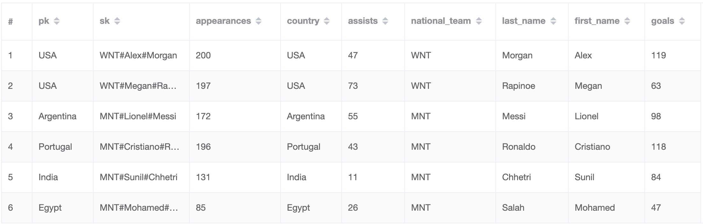

## DynamoDB Pagination

This is an example project that implements various forms of pagination in DynamoDB using Go. A detailed explanation about the various types of pagination and their corresponding implementations in the storage layer of this repository can be found in the article,  [Pagination in DynamoDB: Tips, Tricks and Good Practices](). 

To run this project DynamoDB needs to be installed locally

For local installation of DynamoDB follow [AWS DDB Local Guide](https://docs.aws.amazon.com/amazondynamodb/latest/developerguide/DynamoDBLocal.DownloadingAndRunning.html)

To visualize data in DynamoDB and manage tables download NoSQL Workbench via [NoSQL Workbench Setup](https://docs.aws.amazon.com/amazondynamodb/latest/developerguide/workbench.settingup.html)

### Steps to run the project

* Run DynamoDB locally on port `8000`

* Create the stats table and global index with `sh scripts/soccer_app_create_table.sh`

* Once DynamoDB is installed locally, and the stats table is created, run the project using
  `go run main/main.go`

If the stats table is empty, running the project adds some seed data to the table, which looks something like this

To add additional rows in the table define the input in JSON format under `scripts/stats_app_insert.json` and run the command

`aws dynamodb put-item --table-name player_stats_v1 --item file://stats_app_insert.json --region us-east-1 --endpoint-url http://localhost:8000`